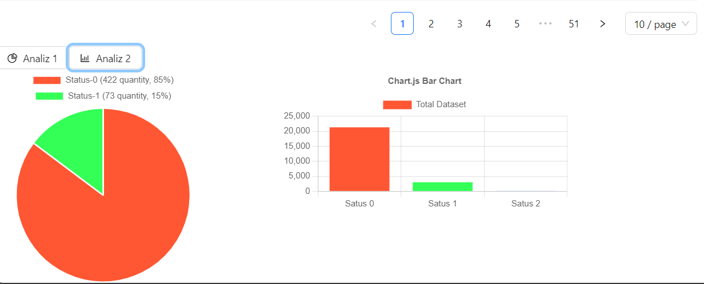

# ExcelTable Component
- The ExcelTable component is a React-based solution for visualizing Excel data in a table, uploading Excel files, searching for specific records, editing data, delete data and visualizing data using charts.

